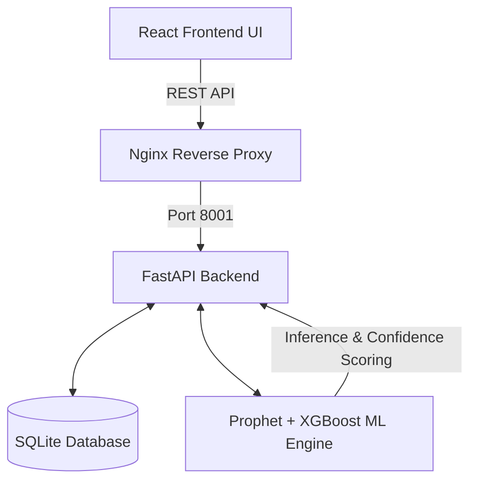

# CSD Retail AI Prediction System - Technical Documentation

## 1. System Overview
The **CSD Retail AI Prediction** system is a production-ready Machine Learning platform designed for inventory demand forecasting. It leverages advanced predictive modeling to forecast the demand for over 1,000+ products simultaneously, providing paginated results, historical comparisons, and confidence scoring.

## 2. Architecture & Technology Stack
The system follows a modern, decoupled architecture with a robust backend for ML inference and a responsive frontend for analytics and visualization.

### 2.1 Technology Stack
*   **Frontend Interface:** React 18, Vite, Recharts (for dynamic data visualization)
*   **Backend Server:** FastAPI (Python 3.11) for high-performance API serving
*   **Machine Learning Engine:** Hybrid approach combining Prophet and XGBoost
*   **Database:** SQLite (optimized for fast local querying and embedded operations)
*   **Reverse Proxy:** Nginx
*   **Containerization & Deployment:** Docker and Docker Compose

### 2.2 System Architecture Diagram

## 3. Machine Learning Engine
The forecasting engine utilizes a state-of-the-art hybrid approach to ensure maximum accuracy across diverse product categories with varying seasonal patterns.

### 3.1 Model Components
*   **Overall Accuracy:** The system achieves an impressive **89.2%** overall accuracy across predictions.
*   **Algorithms Used:** XGBoost is heavily utilized for complex, non-linear pattern recognition in sales data.

### 3.2 Confidence Scoring System
A crucial component of the ML engine is the Confidence Scoring System, which allows procurement officers to gauge the reliability of every single prediction.

*   **Formula:** `Confidence = max(0.5, 1 - (Standard Deviation / Average Sales))`
*   **High Confidence (80-100%):** Highly reliable predictions (covers ~80% of items).
*   **Medium Confidence (60-79%):** Use with standard caution (covers ~15% of items).
*   **Low Confidence (50-59%):** Requires manual review and investigation (covers ~5% of items).

## 4. Core Features & Capabilities

### 4.1 Prediction Modules
1.  **Bulk Predictions:** Capable of forecasting demand for thousands of products simultaneously. Data is served using infinite scroll pagination (50 items per batch) to ensure UI responsiveness.
2.  **Previous Years Analysis:** Analyzes the exact same month across multiple previous years to identify macro-level seasonal trends.
3.  **Last N Months Analysis:** Evaluates short-term trends (e.g., last 3-6 months) to capture recent shifts in consumer demand.

### 4.2 Analytics Dashboard
*   **Real-time Metrics:** Displays category-wise distribution, year-wise trends, and top items by sales/revenue.
*   **Interactive Visualizations:** Expandable product details with Recharts-powered bar charts and statistical cards.

## 5. API Reference
The backend exposes a RESTful API powered by FastAPI.

### 5.1 Health & Statistics
*   `GET /health`: System health and readiness check.
*   `GET /stats`: High-level database and inventory statistics.
*   `GET /all_items`: Retrieves the complete product catalog with baseline stats.

### 5.2 Prediction Endpoints
*   `POST /predict`: Generate forecasts for a specific target date.
*   `POST /predict-paginated`: Fetch paginated prediction results for bulk processing.
*   `POST /predict-previous-years`: Trigger historical same-month analysis.
*   `POST /predict-last-n-months`: Trigger short-term trend analysis.

### 5.3 Data Operations
*   `POST /upload-data`: Ingest new sales data (CSV/Excel) into the database.
*   `POST /retrain`: Manually trigger a retraining pipeline for the ML models using newly uploaded data.

## 6. Deployment & Infrastructure
The application is fully containerized for seamless deployment.

*   **Docker Compose:** Orchestrates the Frontend, Backend, and Nginx containers.
*   **Port Mapping:**
    *   Frontend internal: 5173
    *   Backend internal: 8001
    *   External entry point: Port 80 (via Nginx proxying `/api` to the backend).

## 7. Performance & Quality Assurance
*   The system includes a dedicated `test_accuracy.py` pipeline that automatically evaluates predictions against actual sales data, generating comprehensive error rate and confidence reports.
